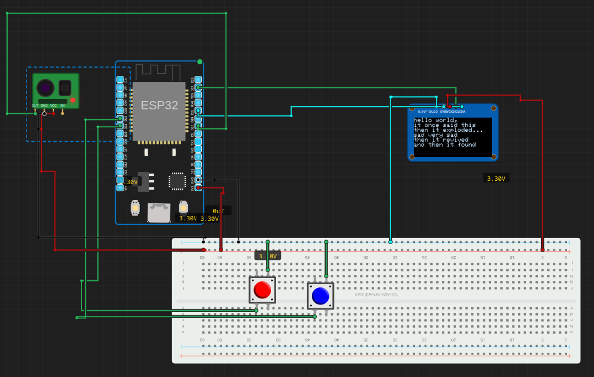

# Fanfiction e-reader

> Built in [Breadboard](https://breadboard.hackclub.com), a Hack Club program. This project took ~6.5 hours of work.

## What It Does

A fanfiction e-reader that powers off if it detects motion! So no one else can see what you're reading >:)

## How It Works

The circuit is captured in `breadboard-project.json`, and the firmware that runs it is in the `firmware/` folder.

## How To Use It

With the buttons you can move up and down to see more lines, with the text being displayed on the oled mini screen. And if something is near, the screen will turn black quickly, until the thing (or person) that was near, moves away.

## Demo

- **Simulate it live:** [https://breadboard.hackclub.com/share/84](https://breadboard.hackclub.com/share/84), runs the firmware in the Breadboard simulator
- **View the design:** [https://taniwankenobi.github.io/breadboard-plays/p/84/](https://taniwankenobi.github.io/breadboard-plays/p/84/)

## Schematic

The editor snapshot is in `breadboard-project.json`.

## Bill of Materials

| Part | Quantity |
| --- | --- |
| breadboard-full | 1 |
| obstacle-avoidance-module | 1 |
| pushbutton | 2 |
| ssd1306-i2c | 1 |

## Firmware

Firmware files are in the `firmware/` folder.

## Build Journal

Build journal entries are kept in [`journals.md`](journals.md).

---

*Made in [Breadboard](https://breadboard.hackclub.com) — 6.5h of work*

